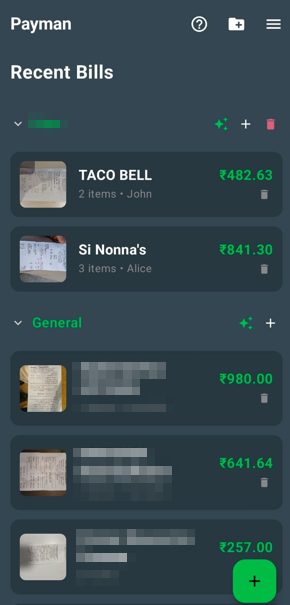
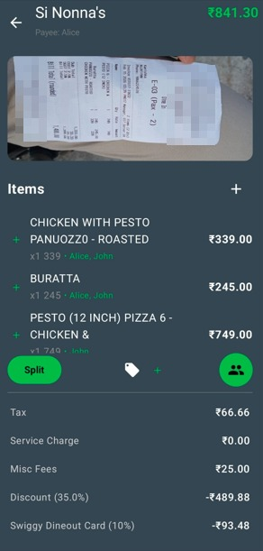
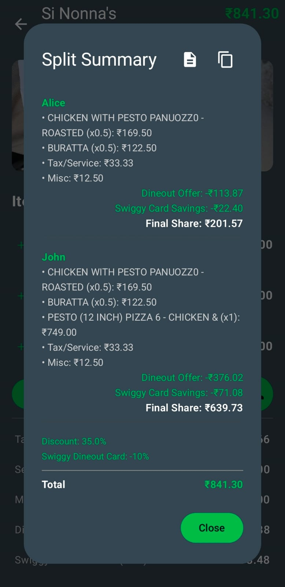
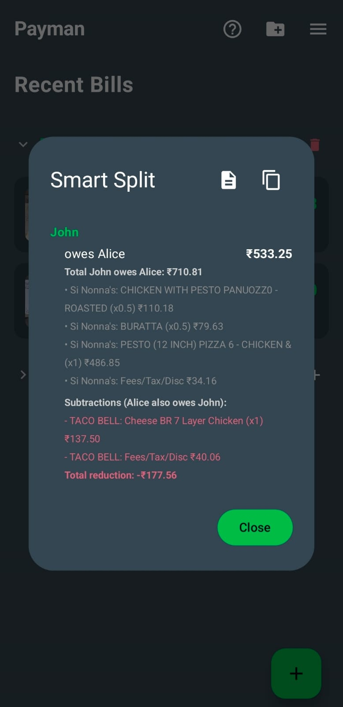
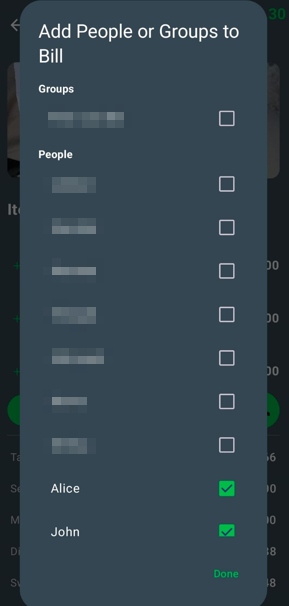
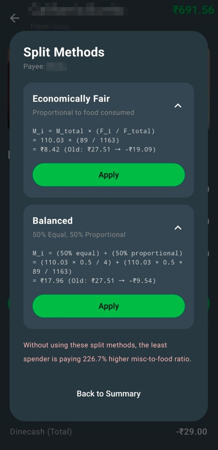

# Payman 🧾💸

**Payman** is a modern, AI-powered Android application designed to take the headache out of splitting restaurant bills and tracking group expenses. Unlike traditional splitters, Payman uses a combination of **On-Device OCR** and **LLM Intelligence** to accurately parse complex bills, handle multi-page receipts, and simplify debts across entire trips or events.

Note that I completely vibe coded this app over the weekend, I had no idea how an android app works until now. If the code looks janky, please do not mind. 

Since the app uses an offline OCR function and later sends the extracted text to Groq's API, rate limiting should not be a problem with the free API key thereby making the app **completely free**. 

TL;DR [Jump to Setup](https://github.com/daem0n707/Payman#%EF%B8%8F-setup).

## ✨ Features

### 🧠 Intelligent Bill Processing
*   **Multi-Image Support:** Capture long receipts by taking multiple photos. Payman automatically merges the text and de-duplicates overlapping items.
*   **AI Parsing:** Leverages the Groq API to convert raw OCR text into structured data, identifying item names, unit prices, quantities, taxes, and service charges.
*   **Local OCR:** Uses Google ML Kit for fast, privacy-focused text recognition directly on your device.

### 🍱 Organized Bill Management
*   **Sections:** Group your bills into custom categories like "Trip to Goa" or "Weekend Brunch" to keep your history organized.
*   **Drag & Drop:** Move bills between sections with a long-press and drag gesture.
*   **Recycle Bin:** Deleted bills are held for 30 days before permanent removal, allowing for easy restoration.

### ⚖️ Advanced Splitting Logic
*   **Individual Item Assignment:** Assign specific items to specific people. If multiple people share an item, the cost (and quantity) is split perfectly among them.
*   **Payee Tracking:** Designate who paid the bill. The app automatically tracks who owes money to the payer.
*   **Smart Split:** A simple logic that simplifies debts across multiple bills. If A owes B ₹100 and B owes A ₹40, Payman simplifies it to "A owes B ₹60."
*   **Comprehensive Discounts & Deductions:** Supports both percentage and fixed-amount discounts for dineout offers from Swiggy and Zomato. 
    *   **Dinecash Handling:** Dinecash deductions are intelligently handled by subtracting the amount *after* the discount percentage has been applied to the subtotal, ensuring accurate final shares.
    *   **Misc & Booking Charges:** Handles convenience fees or dineout booking charges separately. These fees are excluded from discount calculations, as they are usually flat fees that don't scale with the offer. By splitting them separately, Payman ensures these often-forgotten costs are fairly distributed.
    *   **Swiggy HDFC Card (10%):** A dedicated toggle inside settings for users who own the card and would like to split the additional cashback/discount received from it.
*   **Intelligent Split Methods:** Choose how to distribute non-item costs (Misc Fees, Booking Fees) for maximum fairness:
    *   **Equal:** Every participant pays an equal share of the additional fees.
    *   **Economically Fair (Proportional):** Fees are distributed based on each person's food consumption. This prevents someone who only ordered a small side dish from paying the same platform/misc fees as someone who ordered an expensive main course.
    *   **Balanced (Hybrid):** A 50-50 mix of Equal and Proportional splitting, offering a middle ground for group harmony.
*   **Precision Splitting:** Automatically excludes unassigned items from the split totals, providing a clear warning if the sum of individual shares doesn't match the bill total.

### 👥 People & Groups
*   **Collapsible Groups:** Create groups for your friend circles. You can expand a group in Settings to see exactly who is in it.
*   **Quick Add:** Add entire groups to a bill with a single click.

### 📊 Spending Insights
*   **Monthly Breakdown:** View your total spending month-by-month.
*   **Category-wise History:** See exactly where your money went, grouped by bill sections.
*   **Individual Stats:** Filter stats by person to see their specific shares and contribution history.

### 🛠️ Utilities
*   **In-App Calculator:** A handy dark-themed calculator for quick math.
*   **Detailed Logs:** View AI responses and error logs to troubleshoot any processing issues. **Payman now supports separate logs for general errors and Groq API responses.**
*   **Usage and Tour Guide:** A built-in guide explaining the nuances of the splitting logic and the app's features.

## 🚀 Tech Stack

*   **Language:** 100% Kotlin
*   **UI Framework:** Jetpack Compose (Material 3)
*   **Concurrency:** Kotlin Coroutines
*   **Networking:** Retrofit & OkHttp
*   **AI/ML:** 
    *   Google ML Kit (Text Recognition)
    *   Groq API (Generative AI for JSON Extraction)
*   **Image Loading:** Coil
*   **Local Storage:** SharedPreferences (with JSON serialization using Gson)

## 🛠️ Setup

1.  Download the APK file from [releases](https://github.com/daem0n707/Payman/releases/tag/v1.0.0) and install the app.
2.  Obtain a free API key from [Groq](https://console.groq.com/).
3.  Open the app and navigate to **Settings** (Sidebar).
4.  Paste your **Groq API Key** into the provided field.
5.  Start scanning!

## 📸 Screenshots

<table align="center">
  <tr>
    <td></td>
    <td></td>
    <td></td>
  </tr>
  <tr>
    <td></td>
    <td></td>
    <td></td>
  </tr>
</table>

---
*Built with ❤️ for people who are tired of manual bill calculations.*
